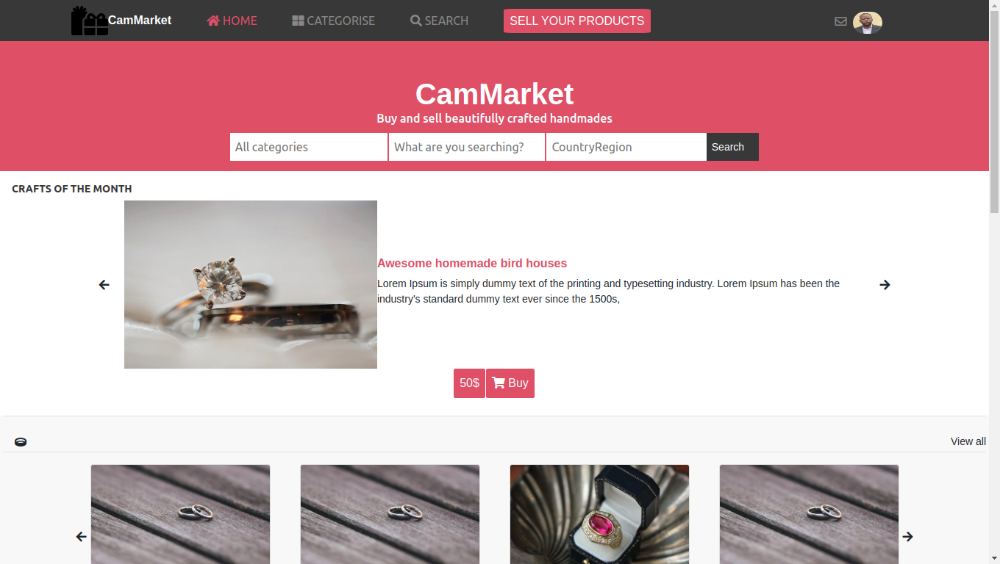

# html-css-capstone




Clone of the The Next Web website page putting emphasis on how it behaves differently depending on the size of the screen.

## Built With

- HTML5
- CSS3
- Bootstrap

## Live Demo

HEAD TO
[CAPSTONE PROJECT](https://collinstatang.github.io/html-css-capstone/)
=======

### Prerequisites

-  Knowledge about HTML, CSS and BOOTSTRAP
-  HTML Semantic elements
-  CSS flex property
-  CSS grid property
-  BOOTSTRAP Technology

## Authors

👤 **Makungong Collins Tatang**

- GitHub: [@CollinsTatang](https://github.com/CollinsTatang)
- Twitter: [@CollinsTatang1](https://twitter.com/CollinsTatang1)
- LinkedIn: [makungong-collins](https://www.linkedin.com/in/makungong-collins-b43260190/)

To get a local copy up and running follow these simple example steps.
- Clone this repository with git clone```https://github.com/CollinsTatang/html-css-capstone.git`` using your terminal or command line.
- Change to the project directory by entering : <br>
```cd html-css-capstone``` in the terminal.

## 🤝 Contributing

Contributions, issues, and feature requests are welcome!

Feel free to check the [issues page](issues/).

## Show your support

Give a ⭐️ if you like this project!

## Acknowledgments

- Hat tip to anyone whose code was used
- Inspiration
- etc

## 📝 License

This project is [MIT](https://choosealicense.com/licenses/mit/) licensed.
